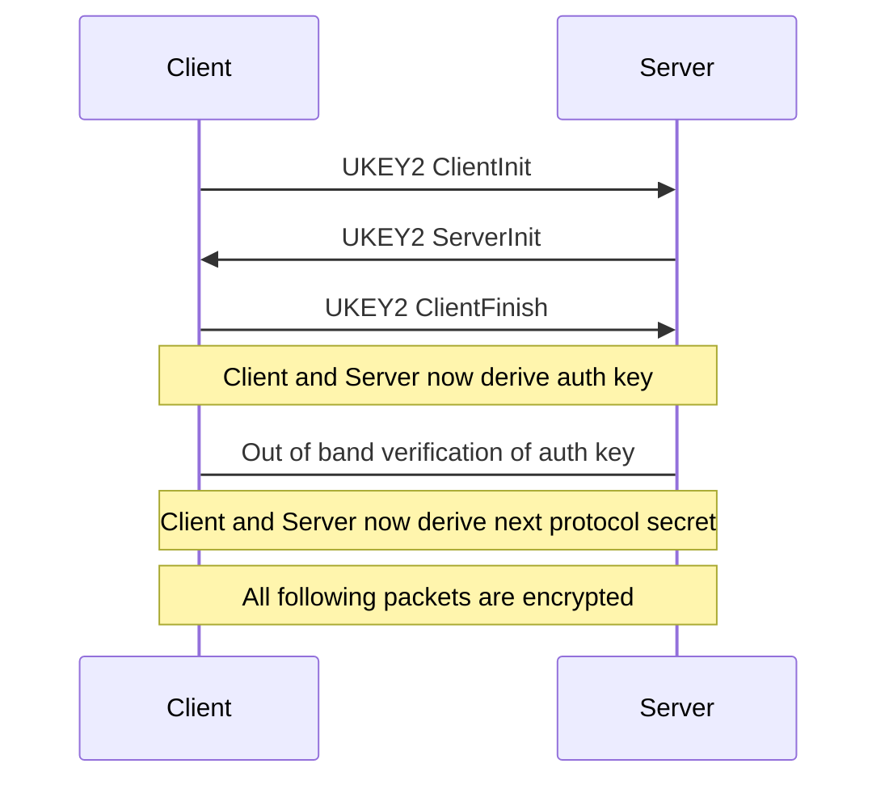

# Ukey2

This is an implementation of ukey2 protocol in Go. The java implementation of the same can be found at [google/ukey2](https://github.com/google/ukey2)

## Protocol



## Usage

### Client

```go
client := ukey2.ForInitiator(ukey2.P256_SHA512)
clientInit, err := client.GetNextHandshakeMessage()
if err != nil {
	// handle error
}
sendMessageToServer(clientInit)
handShakeMessage := receiveMessageFromServer()
_, _, err = client.ParseHandshakeMessage(serverInit)
if err != nil {
	// handle error
}
clientFinish, err := client.GetNextHandshakeMessage()
if err != nil {
	// handle error
}
sendMessageToServer(clientFinish)
verificationString := client.getVerificationString()

// show string to user and verify the key with server key and get confirmation from user
showStringToUser(verificationString)
// call VerifyHandshake once user confirmation received
client.VerifyHandshake()

cc, err := client.ToConnectionContext()
if err != nil {
	// handle error
}
ccv1 := cc.(*d2d.D2DConnectionContextV1)
helloFromClient := ccv1.EncodeMessageToPeer(ccv1, []byte("hello from client"))
// send encrypted message to server
sendMessageToServer(helloFromClient)

serverResponse := receiveMessageFromServer()

helloFromServer, err := ccv1.DecodeMessageFromPeer(ccv1, serverResponse)

if err != nil {
	// handle error
}
```

### Server

```go
server := ukey2.ForResponder(ukey2.P256_SHA512)

clientInit := receiveMessageFromClient()
ok, _, err := server.ParseHandshakeMessage(clientInit)
if ok != true || err != nil {
	// handle error
}
serverInit, err := server.GetNextHandshakeMessage()
if err != nil {
	// handle error
}

sendMessageToClient(serverInit)

clientFinish := receiveMessageFromClient()

_, _, err = server.ParseHandshakeMessage(clientFinish)
if err != nil {
	// handle error
}
verificationString := client.getVerificationString()

// show string to user and verify the key with client key and get confirmation from user
showStringToUser(verificationString)
// call VerifyHandshake once user confirmation received
cc, err := server.ToConnectionContext()
if err != nil {
	// handle error
}
ccv1 := cc.(*d2d.D2DConnectionContextV1)

clientMessage := receiveMessageFromClient() //receive encrypted message from client
helloFromClient, _ := ccv1.DecodeMessageFromPeer(ccv1, clientMessage) // decrypt clientMessage
helloFromServer := ccv1.EncodeMessageToPeer(ccv1, []byte("hello from server")) // encrypt a server message
sendMessageToClient(helloFromServer) // send encrypted message to client
```
